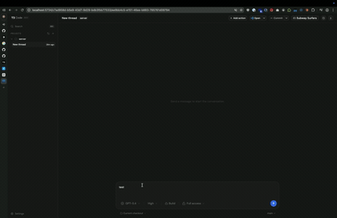

# T3 Code: Subway Surfers Fork

T3 Code is a minimal web GUI for coding agents (currently Codex and Claude, more coming soon).

This fork adds a persistent docked `Subway Surfers` panel on the right side of the app so you have
something to watch or play while your agent works. The main chat content shifts left when the panel
is open, and the panel stays there until you close it.

## Subway Surfers Mode

This fork includes:

- `Play` mode for an embedded Subway Surfers runner
- `Watch` mode for vertical Subway Surfers gameplay
- A docked layout that keeps the panel pinned open instead of floating over the app



## Installation

> [!WARNING]
> T3 Code currently supports Codex and Claude.
> Install and authenticate at least one provider before use:
>
> - Codex: install [Codex CLI](https://github.com/openai/codex) and run `codex login`
> - Claude: install Claude Code and run `claude auth login`

### Run without installing

```bash
npx t3
```

### Desktop app

Install the latest version of the desktop app from [GitHub Releases](https://github.com/pingdotgg/t3code/releases), or from your favorite package registry:

#### Windows (`winget`)

```bash
winget install T3Tools.T3Code
```

#### macOS (Homebrew)

```bash
brew install --cask t3-code
```

#### Arch Linux (AUR)

```bash
yay -S t3code-bin
```

## Some notes

We are very very early in this project. Expect bugs.

We are not accepting contributions yet.

Observability guide: [docs/observability.md](./docs/observability.md)

## If you REALLY want to contribute still.... read this first

Before local development, prepare the environment and install dependencies:

```bash
# Optional: only needed if you use mise for dev tool management.
mise install
bun install .
```

Read [CONTRIBUTING.md](./CONTRIBUTING.md) before opening an issue or PR.

Need support? Join the [Discord](https://discord.gg/jn4EGJjrvv).
